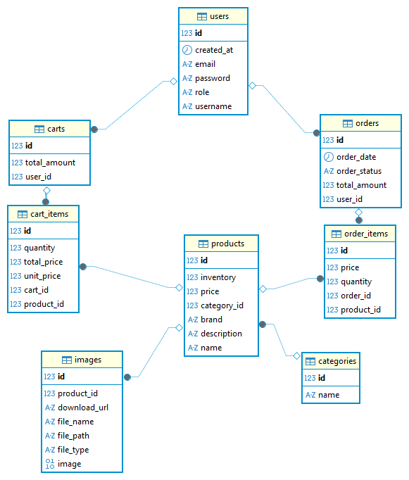

# 🛒 Shopping Cart API

## 📌 Description

A robust and scalable RESTful API built with **Spring Boot** for managing a complete eCommerce shopping cart system.

This application provides a secure and production-ready backend where users can register, authenticate using **JWT-based authentication**, and interact with the system based on their assigned roles.

The system is designed around two primary roles:

- **ADMIN** – Full control over the system, including managing products, categories, images, and orders.
- **USER** – Can browse products, manage their shopping cart, and place orders.

The platform implements real-world business logic such as:

- Full shopping cart lifecycle (add, update, remove items)
- Order creation and status workflow (place, ship, deliver, cancel)
- Product and category management
- Image upload and retrieval for products
- Secure role-based access control using **Spring Security**
- Stateless authentication using **JWT tokens**
- Global exception handling for consistent and clean error responses
- Input validation using **Spring Validation**
- API documentation using **Swagger (OpenAPI)**

The project follows a **clean layered architecture** (Controller → Service → Repository) with DTO mapping using **MapStruct**, making it highly maintainable, testable, and aligned with real-world backend development standards.

---

## 📋 Table of Contents

- [📌 Description](#-description)
- [🛠 Tech Stack](#-tech-stack)
- [🚀 Features](#-features)
- [📡 API Endpoints](#-api-endpoints)
  - [🔐 Authentication](#-authentication)
  - [👤 Users](#-users)
  - [🛍 Products](#-products)
  - [📂 Categories](#-categories)
  - [🖼 Images](#-images)
  - [🛒 Cart](#-cart)
  - [📦 Orders](#-orders)
- [📸 Screenshots](#-screenshots)
- [🎥 Demo Video](#-demo-video)
- [⚙️ Installation Guide](#-installation-guide)
  - [Prerequisites](#1️⃣-prerequisites)
  - [Clone the Repository](#2️⃣-clone-the-repository)
  - [Database Configuration](#3️⃣-database-configuration)
- [🗄 Database Schema](#database-schema)
- [🗺 Database ERD](#database-schema-erd)

## 🛠 Tech Stack

- **Java 21**
- **Spring Boot 3.5**
- **Spring Web** – Building RESTful APIs
- **Spring Data JPA** – Database interaction and ORM
- **Spring Security** – Authentication & authorization
- **JWT (jjwt 0.13)** – Stateless authentication
- **PostgreSQL** – Relational database
- **MapStruct** – DTO ↔ Entity mapping
- **Lombok** – Boilerplate code reduction
- **Spring Validation** – Request validation
- **OpenAPI / Swagger UI (springdoc)** – API documentation
- **Maven** – Dependency management & build tool

---

## 🚀 Features

- 🔐 **JWT Authentication & Authorization**
  - Secure login system using JWT tokens
  - Stateless session management
  - Token validation via custom filter

- 👥 **Role-Based Access Control (RBAC)**
  - **ADMIN** → Full system control
  - **USER** → Shopping, cart, and order operations
  - Method-level security using `@PreAuthorize`

- 🛍 **Product Management**
  - Create, update, delete products (Admin)
  - Search products by:
    - Name
    - Category
    - Brand
  - Count products by filters

- 📂 **Category Management**
  - Full CRUD operations
  - Unique category validation
  - Admin-restricted endpoints

- 🖼 **Image Management**
  - Upload single & multiple images
  - Download images
  - Update & delete images
  - Associate images with products

- 🛒 **Shopping Cart System**
  - Add items to cart
  - Update item quantity
  - Remove items partially or completely
  - Retrieve cart details
  - Calculate total price dynamically

- 📦 **Order Management**
  - Place order from cart
  - Order lifecycle:
    - Create → Ship → Deliver → Cancel
  - Admin-controlled shipping & delivery
  - Users can view their own orders

- 🔎 **User Management**
  - Register & login system
  - Update user profile
  - Admin can:
    - View all users
    - Search by email
    - Delete users

- ⚠️ **Global Exception Handling**
  - Centralized error handling using `@ControllerAdvice`
  - Consistent error response structure
  - Handles:
    - Validation errors
    - Authentication errors
    - Business logic exceptions

- ✅ **Validation Layer**
  - Request validation using annotations (`@Valid`, `@NotBlank`, etc.)
  - Custom validation error responses

- 📄 **API Documentation**
  - Interactive Swagger UI
  - JWT support inside Swagger (Authorize button)
  - Well-structured endpoints with descriptions

- 🧱 **Clean Architecture**
  - Layered structure:
    - Controller → Service → Repository
  - DTO-based communication
  - Separation of concerns

- ⚙️ **Production-Ready Practices**
  - Stateless authentication
  - Secure password encoding
  - Scalable and maintainable code structure
 
## 📡 API Endpoints

### 🔐 Authentication

| Method | Endpoint | Description |
|------|------|------|
| POST | /api/v1/auth/register | Register a new user |
| POST | /api/v1/auth/login | Authenticate user and receive JWT token |

---

### 👤 Users

| Method | Endpoint | Description |
|------|------|------|
| PUT | /api/v1/users/{id} | Update user (Admin or same user) |
| GET | /api/v1/users/{id} | Get user by ID (Admin only) |
| GET | /api/v1/users/search?email={email} | Find user by email (Admin only) |
| GET | /api/v1/users | Get all users (Admin only) |
| DELETE | /api/v1/users/{id} | Delete user (Admin only) |

---

### 🛍 Products

| Method | Endpoint | Description |
|------|------|------|
| POST | /api/v1/products | Add new product (Admin) |
| PUT | /api/v1/products/{id} | Update product (Admin) |
| DELETE | /api/v1/products/{id} | Delete product (Admin) |
| GET | /api/v1/products/{id} | Get product by ID |
| GET | /api/v1/products | Get all products |
| GET | /api/v1/products/search-name?name={name} | Search products by name |
| GET | /api/v1/products/search-category?category={category} | Search by category |
| GET | /api/v1/products/search-brand?brand={brand} | Search by brand |
| GET | /api/v1/products/search-category-brand?category={category}&brand={brand} | Filter by category & brand |
| GET | /api/v1/products/search-brand-name?brand={brand}&name={name} | Filter by brand & name |
| GET | /api/v1/products/count-brand-name?brand={brand}&name={name} | Count filtered products |

---

### 📂 Categories

| Method | Endpoint | Description |
|------|------|------|
| POST | /api/v1/categories | Create category (Admin) |
| PUT | /api/v1/categories/{id} | Update category (Admin) |
| DELETE | /api/v1/categories/{id} | Delete category (Admin) |
| GET | /api/v1/categories/{id} | Get category by ID (Admin) |
| GET | /api/v1/categories/search-name?name={name} | Find category by name (Admin) |
| GET | /api/v1/categories | Get all categories (Admin) |
| GET | /api/v1/categories/count | Count categories (Admin) |

---

### 🖼 Images

| Method | Endpoint | Description |
|------|------|------|
| POST | /api/v1/images/upload | Upload single image (Admin) |
| POST | /api/v1/images/upload-multi | Upload multiple images (Admin) |
| GET | /api/v1/images/{imageId} | Download image |
| PUT | /api/v1/images | Update image |
| DELETE | /api/v1/images/{imageId} | Delete image (Admin) |
| GET | /api/v1/images/product/{productId} | Get images by product ID |

---

### 🛒 Cart

| Method | Endpoint | Description |
|------|------|------|
| POST | /api/v1/cart-items/items/add | Add item to cart (User) |
| PUT | /api/v1/cart-items/{cartId}/items/{itemId}/update | Update item quantity |
| PUT | /api/v1/cart-items/{cartId}/items/{itemId}/remove | Remove item from cart |
| GET | /api/v1/cart-items/cart/{cartId}/product/{productId} | Get specific cart item |
| GET | /api/v1/carts/{cartId}/my-cart | Get cart by ID (Admin) |
| GET | /api/v1/carts/my-cart | Get current user's cart |
| DELETE | /api/v1/carts/{cartId} | Clear cart |
| GET | /api/v1/carts/{cartId}/total-price | Get total cart price |

---

### 📦 Orders

| Method | Endpoint | Description |
|------|------|------|
| POST | /api/v1/orders | Create order |
| GET | /api/v1/orders/{orderId} | Get order by ID |
| GET | /api/v1/orders/my | Get current user's orders |
| GET | /api/v1/orders/users/{userId} | Get user orders (Admin) |
| PATCH | /api/v1/orders/{orderId}/ship | Ship order (Admin) |
| PATCH | /api/v1/orders/{orderId}/deliver | Deliver order (Admin) |
| PATCH | /api/v1/orders/{orderId}/cancel | Cancel order |  

## 📸 Screenshots

All project screenshots will be available in the folder below:

📂 [View Screenshots](./screenshots)

This section will include real examples demonstrating:

- 🔐 User authentication (Register / Login with JWT)
- 🛍 Product management (Create, update, delete)
- 📂 Category management
- 🛒 Shopping cart operations (add, update, remove items)
- 📦 Order workflow (create, ship, deliver, cancel)
- 🖼 Image upload and retrieval
- 📄 Swagger API documentation with secured endpoints

> ⚠️ Screenshots will be added soon.

---

## 🎥 Demo Video

A full walkthrough of the project will be available here:

▶️ **Demo coming soon...**

This demo will cover:

- User registration and login flow
- JWT authentication process
- Role-based access control (Admin vs User)
- Managing products, categories, and images
- Full shopping cart lifecycle
- Placing and managing orders
- Testing secured endpoints via Swagger UI

> ⚠️ Demo video will be uploaded soon.

---

## ⚙️ Installation Guide

Follow the steps below to run the project locally.

---

### 1️⃣ Prerequisites

Make sure you have the following installed:

- Java 21  
- Maven  
- PostgreSQL  
- Git  

---

### 2️⃣ Clone the Repository

```bash
git clone https://github.com/your-username/shopping-cart-API.git
cd shopping-cart-API
```

---

### 3️⃣ Database Configuration

This project uses **Spring Profiles**:

- `dev`
- `staging`
- `prod`

Each profile uses environment variables for database connection.

---

## 🔹 Required Environment Variables

### For `dev` profile:

```
LOCAL_PASSWORD
```

Example:

```
LOCAL_PASSWORD=your_postgres_password
```

---

### For `staging` & `prod` profiles:

```
DB_URL
DB_USER
DB_PASSWORD
```

Example:

```
DB_URL=jdbc:postgresql://localhost:5161/shopping-cart
DB_USER=postgres
DB_PASSWORD=your_password_here
```

---

### Example (Windows PowerShell)

```powershell
setx LOCAL_PASSWORD "your_postgres_password"

setx DB_URL "jdbc:postgresql://localhost:5161/shopping-cart"
setx DB_USER "postgres"
setx DB_PASSWORD "your_password_here"
```

---

### Example (Linux / Mac)

```bash
export LOCAL_PASSWORD=your_postgres_password

export DB_URL=jdbc:postgresql://localhost:5161/shopping-cart
export DB_USER=postgres
export DB_PASSWORD=your_password_here
```

Restart your terminal after setting the variables.

---

### 4️⃣ Database Setup

- Make sure PostgreSQL is running.
- Ensure port `5161` is available.
- Database will be auto-created if configured properly.

---

### 5️⃣ Build the Project

```bash
mvn clean install
```

---

### 6️⃣ Run the Application

#### ▶️ Run with dev profile

```bash
mvn spring-boot:run -Dspring-boot.run.profiles=dev
```

Runs on:

```
http://localhost:8080
```

---

#### ▶️ Run with staging profile

```bash
mvn spring-boot:run -Dspring-boot.run.profiles=staging
```

Runs on:

```
http://localhost:8085
```

---

#### ▶️ Run with prod profile

```bash
mvn spring-boot:run -Dspring-boot.run.profiles=prod
```

Runs on:

```
http://localhost:8000
```

---

### 7️⃣ API Documentation (Swagger)

After the application starts, open:

```
http://localhost:{port}/swagger-ui/index.html
```

Examples:

- Dev → http://localhost:8080/swagger-ui/index.html  
- Staging → http://localhost:8085/swagger-ui/index.html  
- Prod → http://localhost:8000/swagger-ui/index.html  

---

### 8️⃣ Features

- RESTful APIs for Shopping Cart & Orders  
- JWT Authentication & Authorization  
- Spring Security integration  
- PostgreSQL Database  
- Swagger UI for API testing  

---

### ✅ Notes

- Hibernate mode:
  - `dev` → `update`
  - `staging` / `prod` → `validate`
- File upload limit: **5MB**
- Make sure PostgreSQL credentials are correct.
- If database connection fails, double-check environment variables.
- Logging level differs per profile (debug / info / warn)

---

---

# 🗄 Database Schema

## Users

| Column | Type | Constraints |
|------|------|------|
| id | BIGINT | PK, Auto Increment |
| username | VARCHAR | UNIQUE, NOT NULL |
| email | VARCHAR | UNIQUE, NOT NULL |
| password | VARCHAR | NOT NULL |
| role | VARCHAR | ENUM |
| created_at | DATETIME | Created Timestamp |
| last_updated_at | DATETIME | Last Updated Timestamp |

---

## Categories

| Column | Type | Constraints |
|------|------|------|
| id | BIGINT | PK, Auto Increment |
| name | VARCHAR | UNIQUE, NOT NULL |

---

## Products

| Column | Type | Constraints |
|------|------|------|
| id | BIGINT | PK, Auto Increment |
| name | VARCHAR | NOT NULL |
| brand | VARCHAR | |
| price | DECIMAL | NOT NULL |
| inventory | INT | |
| description | TEXT | |
| category_id | BIGINT | FK → Categories(id) |

---

## Images

| Column | Type | Constraints |
|------|------|------|
| id | BIGINT | PK, Auto Increment |
| file_name | VARCHAR | |
| file_type | VARCHAR | |
| file_path | VARCHAR | |
| download_url | VARCHAR | |
| image | BYTEA | |
| product_id | BIGINT | FK → Products(id) |

---

## Carts

| Column | Type | Constraints |
|------|------|------|
| id | BIGINT | PK, Auto Increment |
| total_amount | DECIMAL | Default 0 |
| user_id | BIGINT | FK → Users(id), UNIQUE, NOT NULL |

---

## Cart_Items

| Column | Type | Constraints |
|------|------|------|
| id | BIGINT | PK, Auto Increment |
| quantity | INT | |
| unit_price | DECIMAL | |
| total_price | DECIMAL | |
| cart_id | BIGINT | FK → Carts(id) |
| product_id | BIGINT | FK → Products(id) |

---

## Orders

| Column | Type | Constraints |
|------|------|------|
| id | BIGINT | PK, Auto Increment |
| order_date | DATETIME | Created Timestamp |
| total_amount | DECIMAL | |
| order_status | VARCHAR | ENUM |
| user_id | BIGINT | FK → Users(id) |

---

## Order_Items

| Column | Type | Constraints |
|------|------|------|
| id | BIGINT | PK, Auto Increment |
| price | DECIMAL | |
| quantity | INT | |
| order_id | BIGINT | FK → Orders(id) |
| product_id | BIGINT | FK → Products(id) |

---
# 🗺 Database Schema (ERD)



### 🔗 Relationships

- User → Cart (One-to-One)
- User → Orders (One-to-Many)
- Cart → CartItems (One-to-Many)
- Order → OrderItems (One-to-Many)
- Product → Category (Many-to-One)
- Product → Images (One-to-Many)
